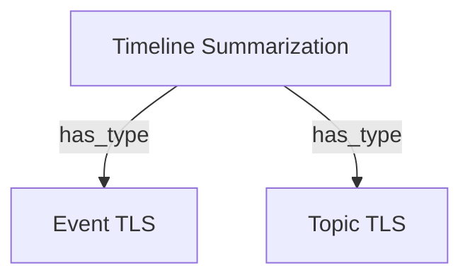

# Graph Generation Pipeline - Algorithmic Flow

## Overview

Complete end-to-end pipeline from PDF input to Mermaid knowledge graph output.

```
PDF File → Extract → Chunk → AI Generate → Merge → Validate → Mermaid
```

---

## Algorithm: High-Level Flow

```python
def generateGraph(pdfFile):
    # === PHASE 1: PREPROCESSING ===
    text = extractPDFText(pdfFile)             # ~1s
    costEstimate = estimateCost(text)          # <100ms
    if costEstimate > budget:
        raise BudgetExceeded

    # === PHASE 2: CHUNKING ===
    chunks = chunkDocument(text)               # <100ms
    # chunks = [Chunk1, Chunk2, Chunk3, ...]

    # === PHASE 3: AI GENERATION (BOTTLENECK) ===
    miniGraphs = []
    for batch in batches(chunks, size=2):      # Process 2 at a time
        graphs = parallel_map(generateMiniGraph, batch)  # ~20s per batch
        miniGraphs.extend(graphs)
    # miniGraphs = [{nodes: [...], edges: [...]}, {...}, ...]

    # === PHASE 4: MERGING (CRITICAL ORDER!) ===
    allNodes = flatten([g.nodes for g in miniGraphs])
    allEdges = flatten([g.edges for g in miniGraphs])

    # 4a. Deduplicate nodes (FIRST!)
    (dedupedNodes, mapping) = deduplicateNodes(allNodes)
    # mapping: {oldId → newId}

    # 4b. Remap edges using mapping (SECOND!)
    remappedEdges = remapEdges(allEdges, mapping)

    # 4c. Deduplicate edges (THIRD!)
    dedupedEdges = deduplicateEdges(remappedEdges)

    # 4d. Validate & auto-fix (FOURTH!)
    (finalNodes, finalEdges) = validateAndFix(dedupedNodes, dedupedEdges)

    # === PHASE 5: OUTPUT ===
    mermaidCode = generateMermaid(finalNodes, finalEdges)

    return {
        nodes: finalNodes,
        edges: finalEdges,
        mermaid: mermaidCode,
        statistics: {...}
    }
```

---

## Phase 1: PDF Extraction

### Algorithm
```python
def extractPDFText(pdfBuffer):
    data = pdf_parse(pdfBuffer)

    if not data.text or data.text.length == 0:
        if isEncrypted(data):
            raise EncryptedPDFError
        if isScanned(data):
            raise ScannedPDFError
        raise ExtractionError("No text found")

    # Clean artifacts
    text = cleanPDFText(data.text)

    return {
        text: text,
        pageCount: data.numpages,
        metadata: extractMetadata(data.info)
    }

def cleanPDFText(rawText):
    # 1. Normalize line endings
    text = normalize(rawText)

    # 2. Fix hyphenation: "knowl-\nedge" → "knowledge"
    text = text.replace(/(\\w+)-\\n(\\w+)/g, '$1$2')

    # 3. Remove page numbers: "Page 1", standalone "1"
    text = removePageNumbers(text)

    # 4. Remove repeated headers/footers
    text = removeRepeatedHeaders(text)

    return text
```

### Complexity
- **Time**: O(n) where n = text length
- **Space**: O(n)
- **Duration**: ~1-2 seconds for 50-page PDF

---

## Phase 2: Text Chunking

### Algorithm
```python
def chunkDocument(text, title):
    if len(text) < MIN_LENGTH:  # 500 chars
        # Skip chunking for small documents
        return createSingleChunk(text)

    # Analyze document structure
    structure = analyzeStructure(text)
    # structure = {type: 'markdown', headings: [...], paragraphs: N}

    if structure.type == 'markdown':
        chunks = chunkByHeadings(text, structure.headings)
    else:
        chunks = chunkBySize(text, maxSize=30000, overlap=1000)

    # Add metadata to each chunk
    for i, chunk in enumerate(chunks):
        chunk.id = f"chunk_{i}"
        chunk.chunkIndex = i
        chunk.totalChunks = len(chunks)
        chunk.headings = extractLocalHeadings(chunk.content)

    return {
        chunks: chunks,
        statistics: {
            totalChunks: len(chunks),
            averageChunkSize: avg([c.length for c in chunks]),
            qualityScore: calculateChunkingQuality(chunks)
        }
    }

def chunkBySize(text, maxSize, overlap):
    chunks = []
    position = 0

    while position < len(text):
        # Find semantic boundary near maxSize
        endPosition = min(position + maxSize, len(text))

        # Try to break at paragraph
        boundary = findParagraphBoundary(text, endPosition)
        if not boundary:
            # Fall back to sentence boundary
            boundary = findSentenceBoundary(text, endPosition)
        if not boundary:
            # Last resort: hard break
            boundary = endPosition

        chunk = text[position:boundary]
        chunks.append(chunk)

        # Move forward with overlap
        position = boundary - overlap

    return chunks
```

### Complexity
- **Time**: O(n) single pass
- **Space**: O(n) for chunk storage
- **Duration**: <100ms for typical document

### Data Structure
```typescript
interface TextChunk {
    id: string;              // "chunk_0", "chunk_1", ...
    content: string;         // Actual text content
    startIndex: number;      // Character position in original
    endIndex: number;
    chunkIndex: number;      // 0, 1, 2, ...
    totalChunks: number;     // Total number of chunks
    headings: string[];      // ["Introduction", "Method", ...]
    overlapWithPrevious: number;  // Characters overlapping with previous chunk
    overlapWithNext: number;      // Characters overlapping with next chunk
}
```

---

## Phase 3: AI Mini-Graph Generation

### Algorithm
```python
def generateMiniGraphs(chunks, documentTitle, maxNodes):
    miniGraphs = []

    # Process in batches of 2 to avoid rate limits
    for i in range(0, len(chunks), BATCH_SIZE=2):
        batch = chunks[i:i+2]

        # Parallel AI calls within batch
        batchResults = parallel_map(
            lambda chunk: generateGraphForChunk(chunk, documentTitle, maxNodes),
            batch
        )

        miniGraphs.extend(batchResults)

        # Progress: 10% + (60% * completion)
        reportProgress(10 + floor((len(miniGraphs) / len(chunks)) * 60))

    return miniGraphs

def generateGraphForChunk(chunk, documentTitle, maxNodes):
    # Build prompt with context
    prompt = buildGraphPrompt({
        chunkContent: chunk.content,
        chunkIndex: chunk.chunkIndex,
        totalChunks: chunk.totalChunks,
        documentTitle: documentTitle,
        headings: chunk.headings,
        maxNodes: maxNodes
    })

    # Call AI with retry + validation
    response = aiOrchestrator.generateWithValidation({
        promptType: 'graph-generation',
        variables: {...},
        outputSchema: GraphOutputSchema,  # Zod validation
        options: {
            model: 'claude-haiku',
            maxRetries: 3,
            temperature: 0
        }
    })

    return {
        nodes: response.data.nodes,
        edges: response.data.edges,
        metadata: {
            chunkIndex: chunk.chunkIndex,
            model: response.model,
            cost: response.cost,
            attempts: response.attempts
        }
    }
```

### AI Prompt Structure
```yaml
System: |
  You are a knowledge graph extraction expert. Extract key concepts and relationships.

User: |
  # Document Context
  Title: {{documentTitle}}
  Section: Chunk {{chunkIndex + 1}} of {{totalChunks}}
  Headings: {{headings}}

  # Text to Analyze
  {{chunkContent}}

  # Task
  Extract up to {{maxNodes}} key concepts and their relationships.

  # Output Format (JSON)
  {
    "nodes": [
      {"id": "node_0", "title": "Concept Name", "description": "Brief explanation"},
      ...
    ],
    "edges": [
      {"from": "node_0", "to": "node_1", "relationship": "is_type_of"},
      ...
    ]
  }

  # Guidelines
  - Focus on domain-specific concepts
  - Use precise technical terms
  - Avoid generic concepts
  - Prefer specific over general
  - Use semantic relationship types (not just "relates_to")
```

### Complexity
- **Time**: O(C * T) where C = chunks, T = AI response time (~20s)
- **Space**: O(C * N) where N = nodes per chunk (~10)
- **Duration**:
  - 1 chunk: ~20s
  - 3 chunks (batched 2+1): ~40s
  - 10 chunks (batched 2 each): ~100s

### Output Structure
```typescript
interface AIGraphOutput {
    nodes: GraphNode[];     // [~10 nodes per chunk]
    edges: GraphEdge[];     // [~12 edges per chunk]
    metadata: {
        chunkIndex: number;
        model: string;      // "claude-haiku"
        cost: number;       // ~$0.003
        attempts: number;   // 1-3
        qualityScore: number; // 80-100
    };
}
```

---

## Phase 4: Graph Merging (CRITICAL ORDER!)

### Algorithm Overview
```python
def mergeGraphsCorrectly(miniGraphs, maxNodes):
    # Combine all nodes and edges from mini-graphs
    allNodes = flatten([g.nodes for g in miniGraphs])
    allEdges = flatten([g.edges for g in miniGraphs])

    log(f"Combined: {len(allNodes)} nodes, {len(allEdges)} edges")

    # CRITICAL: Process in this exact order!
    # Step 1: Deduplicate nodes (get mapping)
    (dedupedNodes, mapping) = deduplicateNodes(allNodes)
    log(f"Deduped: {len(allNodes)} → {len(dedupedNodes)} nodes")

    # Step 2: Remap edges using mapping
    remappedEdges = remapEdges(allEdges, mapping)
    log(f"Remapped: {len(remappedEdges)} edges")

    # Step 3: Deduplicate edges
    dedupedEdges = deduplicateEdges(remappedEdges)
    log(f"Deduped: {len(remappedEdges)} → {len(dedupedEdges)} edges")

    # Step 4: Trim to maxNodes if needed
    if len(dedupedNodes) > maxNodes:
        dedupedNodes = trimToMaxNodes(dedupedNodes, dedupedEdges, maxNodes)

    return {
        nodes: dedupedNodes,
        edges: dedupedEdges,
        mergedCount: len(allNodes) - len(dedupedNodes)
    }
```

### Step 4a: Node Deduplication (3-Phase Algorithm)

```python
def deduplicateNodes(nodes):
    # Initialize Union-Find data structure
    parent = {node.id: node.id for node in nodes}
    rank = {node.id: 0 for node in nodes}

    def find(id):
        # Path compression
        if parent[id] != id:
            parent[id] = find(parent[id])
        return parent[id]

    def union(id1, id2):
        # Union by rank
        root1, root2 = find(id1), find(id2)
        if root1 == root2:
            return

        if rank[root1] < rank[root2]:
            parent[root1] = root2
        elif rank[root1] > rank[root2]:
            parent[root2] = root1
        else:
            parent[root2] = root1
            rank[root1] += 1

    # === PHASE 1: Exact Match ===
    exactMatches = 0
    normalized = {}  # normalized_title → first_id

    for node in nodes:
        norm = normalize(node.title)  # lowercase, trim, collapse spaces

        if norm in normalized:
            union(node.id, normalized[norm])
            exactMatches += 1
        else:
            normalized[norm] = node.id

    log(f"Phase 1 (Exact): {exactMatches} merges")

    # === PHASE 2: Acronym Detection ===
    acronymMatches = 0
    acronyms = [n for n in nodes if isAcronym(n.title)]  # "ML", "TLS", "NLP"
    fullForms = [n for n in nodes if isMultiWord(n.title)]  # "Machine Learning"

    for acronym in acronyms:
        for full in fullForms:
            if find(acronym.id) == find(full.id):
                continue  # Already merged

            if matchesAcronym(acronym.title, full.title):
                union(acronym.id, full.id)
                acronymMatches += 1
                break

    log(f"Phase 2 (Acronym): {acronymMatches} merges")

    # === PHASE 3: Fuzzy Matching ===
    # ⚠️ PROBLEM: Current thresholds too aggressive!
    fuzzyMatches = 0

    for i in range(len(nodes)):
        for j in range(i+1, len(nodes)):
            if find(nodes[i].id) == find(nodes[j].id):
                continue  # Already merged

            # Jaccard word overlap
            words1 = set(nodes[i].title.lower().split())
            words2 = set(nodes[j].title.lower().split())

            intersection = words1 & words2
            unionSet = words1 | words2

            jaccard = len(intersection) / len(unionSet)

            # ⚠️ CURRENT: 70% threshold
            # ❌ PROBLEM: Too aggressive for academic papers!
            # "Event Timeline Summarization" vs "Topic Timeline Summarization"
            # = {timeline, summarization} ∩ {event, topic}
            # = 2/4 = 50% (doesn't merge with current 70%)
            # BUT with 50% threshold, they WOULD merge incorrectly!

            if jaccard >= 0.7:  # CURRENT THRESHOLD
                union(nodes[i].id, nodes[j].id)
                fuzzyMatches += 1

    log(f"Phase 3 (Fuzzy): {fuzzyMatches} merges")

    # === Build Result ===
    # Group nodes by root
    groups = {}
    for node in nodes:
        root = find(node.id)
        if root not in groups:
            groups[root] = []
        groups[root].append(node)

    # Create mapping and deduplicated nodes
    mapping = {}
    dedupedNodes = []

    for root, group in groups.items():
        # Pick best node (longest description)
        best = max(group, key=lambda n: len(n.description or ""))

        dedupedNodes.append({
            id: root,
            title: best.title,
            description: best.description,
            sourceChunk: best.sourceChunk
        })

        # Map all group members to root
        for node in group:
            mapping[node.id] = root

    return (dedupedNodes, mapping)

def isAcronym(title):
    # Check if likely acronym: 2-5 uppercase letters
    return len(title) <= 5 and title.isupper() and title.isalpha()

def matchesAcronym(acronym, fullForm):
    # "ML" matches "Machine Learning"
    words = fullForm.split()
    if len(words) != len(acronym):
        return False

    initials = ''.join(w[0].upper() for w in words)
    return initials == acronym.upper()
```

### Complexity
- **Time**:
  - Phase 1 (Exact): O(n) with hash map
  - Phase 2 (Acronym): O(a * f) where a = acronyms, f = full forms
  - Phase 3 (Fuzzy): O(n²) pairwise comparison
  - Total: **O(n²)** worst case
- **Space**: O(n) for Union-Find
- **Duration**: <100ms for 20 nodes

### Problem: Current Fuzzy Threshold (70%)

**Example failure case**:
```python
Node A: "Timeline Summarization"
Node B: "Event Timeline Summarization"

Words A: {timeline, summarization}
Words B: {event, timeline, summarization}

Jaccard: |{timeline, summarization}| / |{timeline, summarization, event}|
       = 2 / 3
       = 67%  # Below 70% threshold → NOT merged ✓ (correct for now)

# But if we lower threshold to 60-65%:
# → WOULD merge incorrectly! ❌
```

**Why fuzzy matching fails for academic papers**:
- Technical terminology has high word overlap
- Concepts are often variations with modifiers
- "Event TLS" vs "Topic TLS" share 50% words but are DIFFERENT concepts

---

### Step 4b: Edge Remapping

```python
def remapEdges(edges, mapping):
    # CRITICAL: Update edge endpoints to use new node IDs
    remappedEdges = []

    for edge in edges:
        newFrom = mapping.get(edge.from, edge.from)
        newTo = mapping.get(edge.to, edge.to)

        remappedEdges.append({
            from: newFrom,
            to: newTo,
            relationship: edge.relationship,
            metadata: edge.metadata
        })

    return remappedEdges
```

### Complexity
- **Time**: O(E) where E = number of edges
- **Space**: O(E)
- **Duration**: <10ms for 20 edges

### Why This Step is Critical

**Without remapping**:
```python
# Before deduplication:
Node "node_0_chunk_0": "Timeline Summarization"
Node "node_0_chunk_1": "Timeline Summarization"  # Duplicate!
Edge: "node_0_chunk_0" → "node_1" (relationship: "includes")

# After deduplication (if we forgot to remap):
Node "node_0_chunk_0": "Timeline Summarization"  # Kept
# "node_0_chunk_1" DELETED
Edge: "node_0_chunk_1" → "node_1"  # ❌ ORPHANED! Points to deleted node!
```

**With remapping**:
```python
# Mapping: {"node_0_chunk_1" → "node_0_chunk_0"}
Edge: "node_0_chunk_0" → "node_1"  # ✓ Valid! Points to surviving node
```

---

### Step 4c: Edge Deduplication

```python
def deduplicateEdges(edges):
    seen = set()
    uniqueEdges = []

    for edge in edges:
        # Create unique key
        key = f"{edge.from}→{edge.to}→{edge.relationship}"

        if key not in seen:
            seen.add(key)
            uniqueEdges.append(edge)

    return uniqueEdges
```

### Complexity
- **Time**: O(E) with hash set
- **Space**: O(E)
- **Duration**: <10ms

### Example
```python
# Before:
Edge 1: "TLS" → "Event TLS" (relationship: "has_type")
Edge 2: "TLS" → "Event TLS" (relationship: "has_type")  # Duplicate!

# After:
Edge 1: "TLS" → "Event TLS" (relationship: "has_type")  # Kept
# Edge 2 removed
```

---

## Phase 5: Validation & Auto-Fix

### Algorithm
```python
def validateAndFix(nodes, edges):
    nodeIds = set(node.id for node in nodes)
    validEdges = []
    removedEdges = 0

    # Remove orphaned edges
    for edge in edges:
        if edge.from in nodeIds and edge.to in nodeIds:
            # Also remove self-loops
            if edge.from != edge.to:
                validEdges.append(edge)
            else:
                removedEdges += 1
        else:
            removedEdges += 1

    # Calculate quality score
    qualityScore = calculateQualityScore(nodes, validEdges)

    return {
        nodes: nodes,
        edges: validEdges,
        removedEdges: removedEdges,
        qualityScore: qualityScore
    }

def calculateQualityScore(nodes, edges):
    score = 100

    # Penalties
    if len(nodes) < 5:
        score -= 20  # Too few nodes

    if len(edges) == 0:
        score -= 30  # No edges

    avgEdgesPerNode = len(edges) / max(len(nodes), 1)
    if avgEdgesPerNode < 0.5:
        score -= 20  # Sparse graph

    # Rewards
    if avgEdgesPerNode > 1.5:
        score += 10  # Well-connected

    return max(0, min(100, score))
```

### Complexity
- **Time**: O(E) for validation
- **Space**: O(N) for node ID set
- **Duration**: <5ms

---

## Phase 6: Mermaid Code Generation

### Algorithm
```python
def generateMermaidCode(nodes, edges):
    lines = ["flowchart TD"]

    # Node definitions
    for i, node in enumerate(nodes):
        # Sanitize title for Mermaid
        label = sanitizeForMermaid(node.title)

        # Use index_id format for safety
        lines.append(f'    {i}_{node.id}["{label}"]')

    # Edge definitions
    nodeIndexMap = {node.id: i for i, node in enumerate(nodes)}

    for edge in edges:
        fromIndex = nodeIndexMap[edge.from]
        toIndex = nodeIndexMap[edge.to]
        relationship = sanitizeForMermaid(edge.relationship)

        lines.append(f'    {fromIndex}_{edge.from} -->|"{relationship}"| {toIndex}_{edge.to}')

    return '\n'.join(lines)

def sanitizeForMermaid(text):
    # Escape special characters
    text = text.replace('"', '\\"')
    text = text.replace('[', '\\[')
    text = text.replace(']', '\\]')
    return text
```

### Complexity
- **Time**: O(N + E)
- **Space**: O(N + E) for output string
- **Duration**: <5ms

### Example Output


---

## Complete Complexity Analysis

### Time Complexity
| Phase | Operation | Complexity | Duration |
|-------|-----------|------------|----------|
| 1 | PDF Extraction | O(n) | 1s |
| 2 | Chunking | O(n) | 100ms |
| 3 | AI Generation | O(C * T) | 40s (3 chunks) |
| 4a | Node Dedup | O(N²) | 50ms (20 nodes) |
| 4b | Edge Remap | O(E) | 10ms |
| 4c | Edge Dedup | O(E) | 10ms |
| 5 | Validation | O(E) | 5ms |
| 6 | Mermaid Gen | O(N + E) | 5ms |
| **Total** | | **O(C * T + N²)** | **~42s** |

**Bottleneck**: AI generation (Phase 3) accounts for 95% of total time

### Space Complexity
- **Working Memory**: O(C * N) for mini-graphs
- **Peak Memory**: O(N + E) for final graph
- **Total**: **O(C * N)**

### Example: 50-Page PDF
```
Text length: 50,000 chars
Chunks: ceil(50000 / 30000) = 2 chunks
Nodes per chunk: ~10
Edges per chunk: ~12

Time breakdown:
- Extraction: 1s
- Chunking: 100ms
- AI (2 chunks, batch 2): 20s
- Merging: 100ms
- Total: ~21s

Space:
- Mini-graphs: 2 * 10 nodes * ~500 bytes ≈ 10 KB
- Final graph: ~10 nodes, ~15 edges ≈ 5 KB
- Peak: ~15 KB
```

---

## Critical Issues Identified

### Issue 1: Over-Aggressive Fuzzy Deduplication
**Location**: Phase 4a, Fuzzy Matching (line 741)
**Threshold**: 70% Jaccard similarity
**Problem**: Merges semantically distinct concepts with word overlap

**Example**:
```python
"Event Timeline Summarization" (words: {event, timeline, summarization})
"Topic Timeline Summarization" (words: {topic, timeline, summarization})

Jaccard = 2/4 = 50%  # Safe with 70% threshold

BUT if we lower to 50-60%:
→ Would merge incorrectly! ❌
```

**Solution**: Semantic deduplication with embeddings + LLM (see SEMANTIC_DEDUPLICATION_DESIGN.md)

### Issue 2: No Document Structure Awareness
**Location**: Phase 2, Chunking
**Problem**: Treats all text equally, doesn't filter appendices

**Example**: Academic paper with appendices
```python
Main content: Pages 1-9 (want this!)
Appendices: Pages 10-15 (don't want this - contains examples!)
```

**Current**: Chunks everything
**Needed**: Detect "Appendix", "References" sections and exclude

---

## Optimization Opportunities

### 1. Parallel AI Processing
**Current**: Process 2 chunks at a time (sequential batches)
**Potential**: Process all chunks in parallel
**Tradeoff**: Rate limits vs speed

### 2. Caching
**Current**: No caching between chunks
**Potential**: Cache repeated concepts across chunks
**Benefit**: Reduce redundant AI calls

### 3. Early Stopping
**Current**: Process all chunks
**Potential**: Stop if graph quality sufficient after N chunks
**Benefit**: Reduce cost/time

### 4. Incremental Merging
**Current**: Merge all at end
**Potential**: Merge incrementally as chunks complete
**Benefit**: Better memory usage, earlier progress visibility

---

## Summary

**Pipeline**: 6 phases, 42 seconds typical
**Bottleneck**: AI calls (95% of time)
**Critical Bug**: Over-aggressive fuzzy deduplication
**Key Insight**: Need semantic understanding, not string matching

**Next Steps**:
1. **Immediate**: Increase fuzzy threshold to 90% (5 min fix)
2. **Short-term**: Implement embedding-based deduplication (3 hours)
3. **Long-term**: Full semantic deduplication with LLM validation (6 hours)

---

**Generated**: 2024-11-13
**Analyzed File**: `src/services/graph-generator.service.ts`
**Focus**: Algorithmic flow and complexity analysis
