# Knowledge Graph Quality Analysis

## Executive Summary

The generated knowledge graph for the academic paper "From Moments to Milestones: Incremental Timeline Summarization Leveraging Large Language Models" has **severe quality issues** due to the structure-based fallback extracting content from the paper's **appendix examples** rather than the main content.

**Output File**: `output/2024.acl-long.390_graph_2025-11-13T21-31-32.md`
**Quality Score**: 60/100
**Chunks Processed**: 0 (fallback mode)
**Root Cause**: Invalid API keys → AI generation failed → Structure-based fallback extracted appendix headings

---

## What Went Wrong

### 1. API Keys Invalid → Forced Fallback
```
401 authentication errors from Anthropic API
→ AI generation failed after 3 attempts
→ System fell back to structure-based extraction
```

### 2. Structure-Based Fallback Logic (src/services/graph-generator.service.ts:1050-1063)
```typescript
// Extract markdown headings
const headingRegex = /^(#{1,6})\s+(.+)$/gm;
```

**Problem**: This regex extracts ALL markdown headings from the PDF, including those in appendices.

### 3. PDF Content Structure
The paper has this structure:
```
Main Content (Pages 1-9)
  - Abstract
  - Introduction
  - Related Work
  - Method
  - Experiments
  - Results & Analysis
  - Conclusion

Appendices (Pages 10-15) ← PROBLEM: Fallback extracted these!
  A. Prompts
    A.1 Event TLS Prompts
      A.1.1 Membership Classification Prompt
      ### Keyword 1              ← Extracted as node
      Bill Clinton
      ### Content 1              ← Extracted as node
      ### Event Related to 'Bill Clinton'  ← Extracted as node
```

### 4. Resulting Graph Nodes
The fallback created nodes from appendix examples:
- "of topics9447" (extraction artifact from page count)
- "of timelines192247" (extraction artifact)
- "Answer", "Instruction", "Format" (from prompt template structure)
- "Keyword 1", "Content 1" (from few-shot examples)
- "Event Related to 'Bill Clinton'" (from example output)

**None of these represent the paper's actual concepts!**

---

## How Claude (Me) Would Create This Graph

### Step 1: Hierarchical Concept Extraction

I would identify concepts at multiple levels:

#### **Level 1: Problem Domain**
```
Timeline Summarization (TLS)
├─ Event TLS
│  ├─ Input: Tweet streams
│  ├─ Output: Momentary updates
│  └─ Example: Crisis events
└─ Topic TLS
   ├─ Input: News articles
   ├─ Output: Milestone events
   └─ Example: Biography timelines
```

#### **Level 2: Proposed Solution**
```
LLM-TLS
├─ Unifies Event and Topic TLS
├─ Uses: Llama2-13B
├─ Approach: Incremental clustering
└─ Components:
   ├─ Cluster (Event detection)
   └─ Summarize (Generate descriptions)
```

#### **Level 3: Technical Pipeline**
```
Event Clustering
├─ Vector Retrieval
│  ├─ Embeddings: GTE-large
│  └─ Top-N: 20 similar items
├─ Membership Classification
│  ├─ Fine-tuned Llama2-13B
│  └─ Pairwise queries
└─ Temporal Heuristic
   └─ 24-hour window
```

#### **Level 4: Experiments & Results**
```
Datasets
├─ Event TLS: CrisisLTLSum (772 timelines)
└─ Topic TLS:
   ├─ T17 (9 topics, 212 day avg)
   ├─ CRISIS (4 topics, 343 day avg)
   └─ ENTITIES (47 topics, 4437 day avg)

Performance
├─ Event TLS: 89.63% precision (retrieval mode)
└─ Topic TLS: Outperforms all 5 baselines
```

### Step 2: Semantic Relationships

Instead of generic `contains`, I would use meaningful relationships:

```
LLM-TLS --[unifies]--> Event TLS
LLM-TLS --[unifies]--> Topic TLS
LLM-TLS --[uses]--> Llama2-13B
LLM-TLS --[employs]--> LLM as Pseudo-Oracle
Event Clustering --[applies]--> GTE Embeddings
Event Clustering --[applies]--> Membership Classification
Topic TLS --[selects]--> Milestone Events
Date Selection --[replaces]--> Milestone Event Selection
LLM-TLS --[outperforms]--> MARTSCHAT
LLM-TLS --[outperforms]--> DATEWISE
LLM-TLS --[outperforms]--> SDF
LLM-TLS --[outperforms]--> CLUST
LLM-TLS --[outperforms]--> EGC
```

### Step 3: Proper Mermaid Diagram

```mermaid
flowchart TD
    %% Problem Domain
    TLS[Timeline Summarization<br/>TLS]
    EventTLS[Event TLS]
    TopicTLS[Topic TLS]

    TLS --> EventTLS
    TLS --> TopicTLS

    EventTLS --> EventGoal[Momentary updates<br/>from tweet streams]
    TopicTLS --> TopicGoal[Milestone events<br/>from news corpora]

    %% Proposed Solution
    LLMTLS[LLM-TLS<br/>Unified Approach]
    LLMTLS --> UnifyEvent[Unifies<br/>Event TLS]
    LLMTLS --> UnifyTopic[Unifies<br/>Topic TLS]

    %% Model
    Model[Llama2-13B]
    LLMTLS --> Model

    %% Pipeline
    Pipeline[Two-Step Pipeline]
    LLMTLS --> Pipeline

    Pipeline --> Step1[Step 1: Cluster]
    Pipeline --> Step2[Step 2: Summarize]

    %% Clustering Details
    Step1 --> Retrieval[Vector Retrieval<br/>GTE Embeddings<br/>Top-20]
    Step1 --> MemberClass[Membership<br/>Classification<br/>Fine-tuned LLM]
    Step1 --> Temporal[Temporal Heuristic<br/>24-hour window]

    %% Datasets
    Datasets[Benchmark Datasets]
    Crisis[CrisisLTLSum<br/>772 event timelines<br/>tweet streams]
    T17[T17<br/>9 topics<br/>212 days avg]
    CRISIS[CRISIS<br/>4 topics<br/>343 days avg]
    ENTITIES[ENTITIES<br/>47 topics<br/>4437 days avg]

    Datasets --> Crisis
    Datasets --> T17
    Datasets --> CRISIS
    Datasets --> ENTITIES

    %% Results
    Results[Performance]
    Results --> Perf1[Event TLS:<br/>89.63% precision<br/>81.94% F1]
    Results --> Perf2[Topic TLS:<br/>Outperforms 5 baselines<br/>on all 3 datasets]

    %% Baselines
    Baselines[Baseline Methods]
    Baselines --> B1[MARTSCHAT<br/>Submodular optimization]
    Baselines --> B2[DATEWISE<br/>Supervised date selection]
    Baselines --> B3[SDF<br/>Summarize date first]
    Baselines --> B4[CLUST<br/>Markov clustering]
    Baselines --> B5[EGC<br/>Event graph compression]

    LLMTLS -.outperforms.-> B1
    LLMTLS -.outperforms.-> B2
    LLMTLS -.outperforms.-> B3
    LLMTLS -.outperforms.-> B4
    LLMTLS -.outperforms.-> B5
```



---

## Comparison: Current vs. Ideal

### Current Output (Quality: 60/100)
```
Nodes: 26 nonsensical names
Edges: 8 all "contains"
Content: Extracted from appendix prompt examples
Relationships: No semantic meaning
Structure: Flat, no hierarchy
```

### Ideal Output (Quality: 95/100)
```
Nodes: ~30 meaningful concepts
Edges: ~40 typed relationships
Content: Core research concepts
Relationships: Semantic (unifies, uses, outperforms, etc.)
Structure: Hierarchical (Problem → Solution → Implementation → Results)
```

---

## Root Cause Analysis

### Issue 1: Fallback Treats All Headings Equally
**Location**: `src/services/graph-generator.service.ts:1050-1063`

**Problem**: Regex extracts ALL markdown headings without filtering:
```typescript
const headingRegex = /^(#{1,6})\s+(.+)$/gm;
```

**Why It Failed**: Academic PDFs often have:
- Main content headings (want these)
- Appendix headings (don't want these)
- Example/template headings in appendices (DEFINITELY don't want these)

The fallback has no logic to:
1. Detect appendix boundaries
2. Filter out example content
3. Prioritize early sections over late sections
4. Understand document structure semantically

### Issue 2: No Content-Based Filtering
The fallback doesn't analyze heading text to detect:
- Example markers ("Keyword 1", "Content 1")
- Template placeholders ("{keyword}")
- Instruction headings ("### Instruction", "### Format")

### Issue 3: No Semantic Understanding
Structure-based extraction is fundamentally limited:
- Can't identify important vs. unimportant concepts
- Can't infer relationships beyond hierarchical "contains"
- Can't understand context or meaning
- Can't distinguish main content from meta-content

---

## Recommended Fixes

### Priority 1: Fix API Keys (Immediate)
**Impact**: Eliminates need for fallback entirely
**Action**: Generate new valid API keys from Anthropic/OpenAI dashboards

### Priority 2: Improve Fallback Logic (Short-term)
**Impact**: Better fallback quality when AI fails
**Location**: `src/services/graph-generator.service.ts:1041-1149`

**Improvements needed**:
1. **Appendix Detection**: Skip content after "References", "Appendix", "Acknowledgments"
2. **Example Filtering**: Exclude headings with patterns like "Keyword N", "Content N", "Event Related to"
3. **Section Weighting**: Prioritize headings from Introduction, Method, Results
4. **Depth Limiting**: For academic papers, focus on h1-h3, ignore h4-h6

### Priority 3: Enhance Prompts (Medium-term)
**Impact**: Better AI-generated graphs
**Location**: `src/lib/ai/prompt-templates.ts`

**Improvements needed**:
1. Add academic paper-specific instructions
2. Request hierarchical concept extraction
3. Specify relationship types beyond "contains"
4. Request section-aware processing (skip appendices)

### Priority 4: Add Document Type Detection (Long-term)
**Impact**: Tailored processing for different document types

**New logic needed**:
```typescript
if (documentType === 'academic-paper') {
  // Different prompts, different fallback logic
} else if (documentType === 'news-article') {
  // Different strategy
}
```

---

## Implementation Roadmap

### Phase 1: Immediate Fix (1 hour)
```
☐ Generate new Anthropic API key
☐ Generate new OpenAI API key
☐ Update .env file
☐ Test graph generation with valid keys
```

### Phase 2: Fallback Improvements (4 hours)
```
☐ Add appendix detection to fallback
☐ Add example/template filtering
☐ Implement section weighting
☐ Test on academic papers
```

### Phase 3: Prompt Engineering (2 hours)
```
☐ Create academic-paper-specific prompt
☐ Add hierarchical extraction instructions
☐ Add relationship type diversity
☐ Test on multiple papers
```

### Phase 4: Advanced Features (8 hours)
```
☐ Document type detection
☐ Custom processing per type
☐ Quality metrics per type
☐ Comprehensive testing
```

---

## Testing Strategy

### Test Cases Needed
1. **Academic paper with appendices** (current failure)
2. **News article** (different structure)
3. **Technical documentation** (hierarchical)
4. **Blog post** (less structured)
5. **Research proposal** (future-focused)

### Success Criteria
- Quality score > 85/100 for academic papers
- No appendix content in final graph
- Meaningful relationship types (not just "contains")
- Hierarchical structure preserved
- Main concepts identified correctly

---

## Conclusion

The current output quality issue is **entirely due to the structure-based fallback's naive heading extraction**, which doesn't understand document structure or filter out meta-content like examples and templates.

**The system architecture is sound** - when AI generation works (with valid keys), it should produce much better graphs. However, even with valid keys, improvements to prompt engineering and document understanding would significantly enhance quality.

**Immediate action**: Fix the API keys to unlock AI-powered generation.
**Follow-up action**: Improve fallback logic as a safety net.
**Long-term action**: Add document-type-aware processing.

---

**Generated**: 2024-11-13
**Analyzed File**: 2024.acl-long.390.pdf
**Output File**: output/2024.acl-long.390_graph_2025-11-13T21-31-32.md
**System Version**: Phase 3.3 Complete
