# Knowledge Graph: structure-fallback

**Generated from:** `2024.acl-long.390.pdf`
**Date:** 2025-11-13T22:25:57.237Z
**Processing time:** 0.0s
**Cost:** $0.0000

---

## Graph Statistics

- **Nodes:** 26
- **Edges:** 8
- **Chunks processed:** 0
- **Merged nodes:** 0
- **Duplicate edges removed:** 0
- **Quality score:** 60/100

---

## Nodes

1. **of topics9447**
2. **of timelines192247**
3. **Answer**
4. **Instruction**
5. **Format**
6. **Keyword 1**
7. **Content 1**
8. **Event Related to ’Bill Clinton’**
9. **Keyword 2**
10. **Content 2**
11. **Event Related to ’{keyword}’**
12. **Keyword**
13. **Event 1**
14. **Event 2**
15. **Answer**
16. **Keyword**
17. **Event 2**
18. **Answer**
19. **Keyword**
20. **Event 1**
21. **Event 2**
22. **Answer**
23. **Keyword**
24. **Event 1**
25. **Event 2**
26. **Answer**

---

## Relationships

1. **Answer** → `contains` → **Instruction**
2. **Answer** → `contains` → **Format**
3. **Answer** → `contains` → **Keyword 1**
4. **Answer** → `contains` → **Content 1**
5. **Answer** → `contains` → **Event Related to ’Bill Clinton’**
6. **Answer** → `contains` → **Keyword 2**
7. **Answer** → `contains` → **Content 2**
8. **Answer** → `contains` → **Event Related to ’{keyword}’**

---

## Mermaid Diagram

```mermaid
flowchart TD
    node_0["of topics9447"]
    node_1["of timelines192247"]
    node_2["Answer"]
    node_3["Instruction"]
    node_4["Format"]
    node_5["Keyword 1"]
    node_6["Content 1"]
    node_7["Event Related to ’Bill Clinton’"]
    node_8["Keyword 2"]
    node_9["Content 2"]
    node_10["Event Related to ’{keyword}’"]
    node_11["Keyword"]
    node_12["Event 1"]
    node_13["Event 2"]
    node_14["Answer"]
    node_15["Keyword"]
    node_16["Event 2"]
    node_17["Answer"]
    node_18["Keyword"]
    node_19["Event 1"]
    node_20["Event 2"]
    node_21["Answer"]
    node_22["Keyword"]
    node_23["Event 1"]
    node_24["Event 2"]
    node_25["Answer"]
    node_2 -->|"contains"| node_3
    node_2 -->|"contains"| node_4
    node_2 -->|"contains"| node_5
    node_2 -->|"contains"| node_6
    node_2 -->|"contains"| node_7
    node_2 -->|"contains"| node_8
    node_2 -->|"contains"| node_9
    node_2 -->|"contains"| node_10
```

---

## How to Visualize

1. Copy the Mermaid code above
2. Paste it into one of these tools:
   - [Mermaid Live Editor](https://mermaid.live)
   - [GitHub Markdown](https://github.com) (supports Mermaid natively)
   - [VS Code with Mermaid extension](https://marketplace.visualstudio.com/items?itemName=bierner.markdown-mermaid)

---

*Generated with Graphex Graph Generation Pipeline v1.0*
