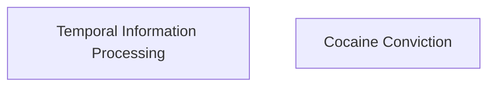

# Knowledge Graph: claude-haiku

**Generated from:** `2024.acl-long.390.pdf`
**Date:** 2025-11-14T09:08:23.625Z
**Processing time:** 37.9s
**Cost:** $0.0000

---

## Graph Statistics

- **Nodes:** 2
- **Edges:** 0
- **Chunks processed:** 3
- **Merged nodes:** 20
- **Duplicate edges removed:** 20
- **Quality score:** 30/100

---

## Nodes

1. **Temporal Information Processing**
2. **Cocaine Conviction**

---

## Relationships

---

## Mermaid Diagram

---

## How to Visualize

1. Copy the Mermaid code above
2. Paste it into one of these tools:
   - [Mermaid Live Editor](https://mermaid.live)
   - [GitHub Markdown](https://github.com) (supports Mermaid natively)
   - [VS Code with Mermaid extension](https://marketplace.visualstudio.com/items?itemName=bierner.markdown-mermaid)

---

*Generated with Graphex Graph Generation Pipeline v1.0*
