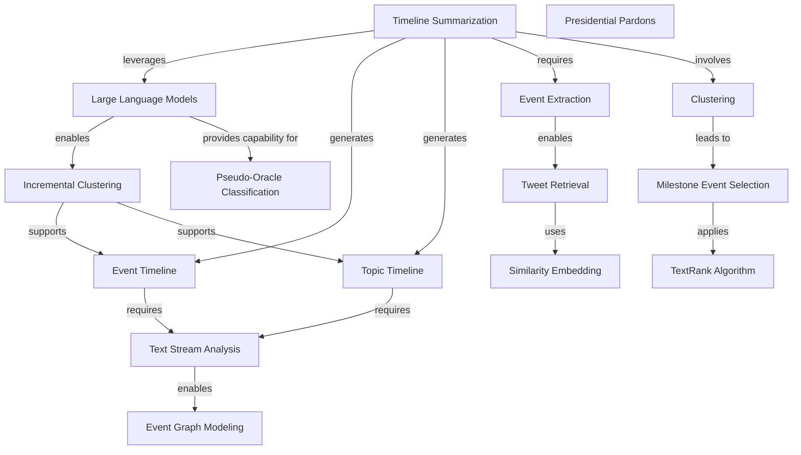

# Knowledge Graph: claude-haiku

**Generated from:** `2024.acl-long.390.pdf`
**Date:** 2025-11-14T09:12:40.885Z
**Processing time:** 40.4s
**Cost:** $0.0000

---

## Graph Statistics

- **Nodes:** 15
- **Edges:** 16
- **Chunks processed:** 3
- **Merged nodes:** 2
- **Duplicate edges removed:** 0
- **Quality score:** 90/100

---

## Nodes

1. **Timeline Summarization**
2. **Presidential Pardons**
3. **Large Language Models**
4. **Event Timeline**
5. **Topic Timeline**
6. **Incremental Clustering**
7. **Text Stream Analysis**
8. **Event Extraction**
9. **Clustering**
10. **Tweet Retrieval**
11. **Milestone Event Selection**
12. **Event Graph Modeling**
13. **Pseudo-Oracle Classification**
14. **Similarity Embedding**
15. **TextRank Algorithm**

---

## Relationships

1. **Timeline Summarization** → `leverages` → **Large Language Models**
2. **Timeline Summarization** → `generates` → **Event Timeline**
3. **Timeline Summarization** → `generates` → **Topic Timeline**
4. **Large Language Models** → `enables` → **Incremental Clustering**
5. **Incremental Clustering** → `supports` → **Event Timeline**
6. **Incremental Clustering** → `supports` → **Topic Timeline**
7. **Event Timeline** → `requires` → **Text Stream Analysis**
8. **Topic Timeline** → `requires` → **Text Stream Analysis**
9. **Text Stream Analysis** → `enables` → **Event Graph Modeling**
10. **Timeline Summarization** → `requires` → **Event Extraction**
11. **Timeline Summarization** → `involves` → **Clustering**
12. **Event Extraction** → `enables` → **Tweet Retrieval**
13. **Clustering** → `leads to` → **Milestone Event Selection**
14. **Large Language Models** → `provides capability for` → **Pseudo-Oracle Classification**
15. **Tweet Retrieval** → `uses` → **Similarity Embedding**
16. **Milestone Event Selection** → `applies` → **TextRank Algorithm**

---

## Mermaid Diagram

---

## How to Visualize

1. Copy the Mermaid code above
2. Paste it into one of these tools:
   - [Mermaid Live Editor](https://mermaid.live)
   - [GitHub Markdown](https://github.com) (supports Mermaid natively)
   - [VS Code with Mermaid extension](https://marketplace.visualstudio.com/items?itemName=bierner.markdown-mermaid)

---

*Generated with Graphex Graph Generation Pipeline v1.0*
