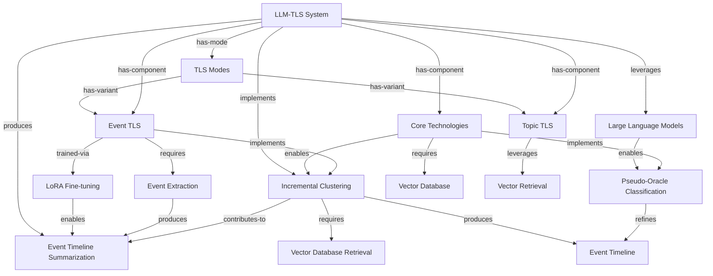

# Knowledge Graph: claude-haiku

**Generated from:** `2024.acl-long.390.pdf`
**Date:** 2025-11-14T09:27:13.094Z
**Processing time:** 59.6s
**Cost:** $0.0000

---

## Graph Statistics

- **Nodes:** 15
- **Edges:** 23
- **Chunks processed:** 3
- **Merged nodes:** 8
- **Duplicate edges removed:** 0
- **Quality score:** 100/100

---

## Nodes

1. **LLM-TLS System**
2. **Incremental Clustering**
3. **Event TLS**
4. **Event Timeline Summarization**
5. **Core Technologies**
6. **Pseudo-Oracle Classification**
7. **TLS Modes**
8. **Topic TLS**
9. **Large Language Models**
10. **Event Timeline**
11. **LoRA Fine-tuning**
12. **Event Extraction**
13. **Vector Database Retrieval**
14. **Vector Database**
15. **Vector Retrieval**

---

## Relationships

1. **LLM-TLS System** → `leverages` → **Large Language Models**
2. **LLM-TLS System** → `implements` → **Incremental Clustering**
3. **Large Language Models** → `enables` → **Pseudo-Oracle Classification**
4. **Incremental Clustering** → `requires` → **Vector Database Retrieval**
5. **LLM-TLS System** → `produces` → **Event Timeline Summarization**
6. **LLM-TLS System** → `has-component` → **Core Technologies**
7. **LLM-TLS System** → `has-mode` → **TLS Modes**
8. **Core Technologies** → `enables` → **Incremental Clustering**
9. **Core Technologies** → `implements` → **Pseudo-Oracle Classification**
10. **Core Technologies** → `requires` → **Vector Database**
11. **TLS Modes** → `has-variant` → **Event TLS**
12. **TLS Modes** → `has-variant` → **Topic TLS**
13. **Incremental Clustering** → `produces` → **Event Timeline**
14. **Pseudo-Oracle Classification** → `refines` → **Event Timeline**
15. **LLM-TLS System** → `has-component` → **Event TLS**
16. **LLM-TLS System** → `has-component` → **Topic TLS**
17. **Event TLS** → `trained-via` → **LoRA Fine-tuning**
18. **Event TLS** → `requires` → **Event Extraction**
19. **Event TLS** → `implements` → **Incremental Clustering**
20. **Topic TLS** → `leverages` → **Vector Retrieval**
21. **LoRA Fine-tuning** → `enables` → **Event Timeline Summarization**
22. **Event Extraction** → `produces` → **Event Timeline Summarization**
23. **Incremental Clustering** → `contributes-to` → **Event Timeline Summarization**

---

## Mermaid Diagram

---

## How to Visualize

1. Copy the Mermaid code above
2. Paste it into one of these tools:
   - [Mermaid Live Editor](https://mermaid.live)
   - [GitHub Markdown](https://github.com) (supports Mermaid natively)
   - [VS Code with Mermaid extension](https://marketplace.visualstudio.com/items?itemName=bierner.markdown-mermaid)

---

*Generated with Graphex Graph Generation Pipeline v1.0*
