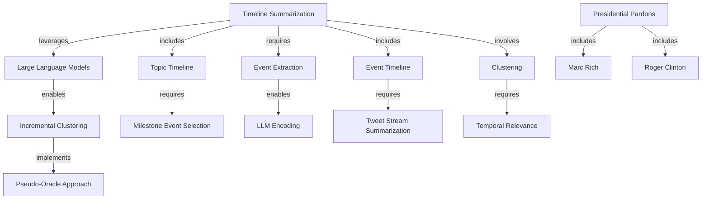

# Knowledge Graph: claude-haiku

**Generated from:** `2024.acl-long.390.pdf`
**Date:** 2025-11-14T09:50:15.690Z
**Processing time:** 100.1s
**Cost:** $0.0000

---

## Graph Statistics

- **Nodes:** 15
- **Edges:** 13
- **Chunks processed:** 3
- **Merged nodes:** 2
- **Duplicate edges removed:** 0
- **Quality score:** 100/100

---

## Nodes

1. **Timeline Summarization**
2. **Presidential Pardons**
3. **Large Language Models**
4. **Event Timeline**
5. **Topic Timeline**
6. **Incremental Clustering**
7. **Milestone Event Selection**
8. **Event Extraction**
9. **Clustering**
10. **LLM Encoding**
11. **Marc Rich**
12. **Roger Clinton**
13. **Pseudo-Oracle Approach**
14. **Tweet Stream Summarization**
15. **Temporal Relevance**

---

## Relationships

1. **Timeline Summarization** → `leverages` → **Large Language Models**
2. **Timeline Summarization** → `includes` → **Event Timeline**
3. **Timeline Summarization** → `includes` → **Topic Timeline**
4. **Large Language Models** → `enables` → **Incremental Clustering**
5. **Incremental Clustering** → `implements` → **Pseudo-Oracle Approach**
6. **Event Timeline** → `requires` → **Tweet Stream Summarization**
7. **Topic Timeline** → `requires` → **Milestone Event Selection**
8. **Timeline Summarization** → `requires` → **Event Extraction**
9. **Timeline Summarization** → `involves` → **Clustering**
10. **Event Extraction** → `enables` → **LLM Encoding**
11. **Clustering** → `requires` → **Temporal Relevance**
12. **Presidential Pardons** → `includes` → **Marc Rich**
13. **Presidential Pardons** → `includes` → **Roger Clinton**

---

## Mermaid Diagram

---

## How to Visualize

1. Copy the Mermaid code above
2. Paste it into one of these tools:
   - [Mermaid Live Editor](https://mermaid.live)
   - [GitHub Markdown](https://github.com) (supports Mermaid natively)
   - [VS Code with Mermaid extension](https://marketplace.visualstudio.com/items?itemName=bierner.markdown-mermaid)

---

*Generated with Graphex Graph Generation Pipeline v1.0*
