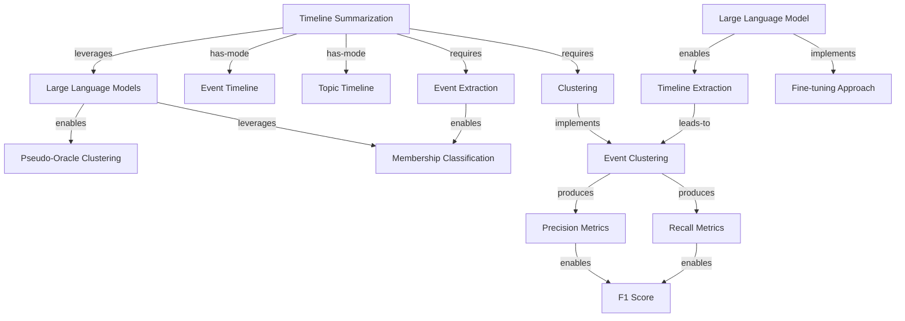

# Knowledge Graph: claude-haiku

**Generated from:** `2024.acl-long.390.pdf`
**Date:** 2025-11-14T09:56:01.493Z
**Processing time:** 48.4s
**Cost:** $0.0000

---

## Graph Statistics

- **Nodes:** 15
- **Edges:** 16
- **Chunks processed:** 3
- **Merged nodes:** 3
- **Duplicate edges removed:** 0
- **Quality score:** 100/100

---

## Nodes

1. **Timeline Summarization**
2. **Event Clustering**
3. **Large Language Models**
4. **Event Extraction**
5. **Large Language Model**
6. **Event Timeline**
7. **Topic Timeline**
8. **Pseudo-Oracle Clustering**
9. **Clustering**
10. **Membership Classification**
11. **Timeline Extraction**
12. **Fine-tuning Approach**
13. **Precision Metrics**
14. **Recall Metrics**
15. **F1 Score**

---

## Relationships

1. **Timeline Summarization** → `leverages` → **Large Language Models**
2. **Timeline Summarization** → `has-mode` → **Event Timeline**
3. **Timeline Summarization** → `has-mode` → **Topic Timeline**
4. **Large Language Models** → `enables` → **Pseudo-Oracle Clustering**
5. **Timeline Summarization** → `requires` → **Event Extraction**
6. **Timeline Summarization** → `requires` → **Clustering**
7. **Event Extraction** → `enables` → **Membership Classification**
8. **Large Language Models** → `leverages` → **Membership Classification**
9. **Clustering** → `implements` → **Event Clustering**
10. **Large Language Model** → `enables` → **Timeline Extraction**
11. **Large Language Model** → `implements` → **Fine-tuning Approach**
12. **Timeline Extraction** → `leads-to` → **Event Clustering**
13. **Event Clustering** → `produces` → **Precision Metrics**
14. **Event Clustering** → `produces` → **Recall Metrics**
15. **Precision Metrics** → `enables` → **F1 Score**
16. **Recall Metrics** → `enables` → **F1 Score**

---

## Mermaid Diagram

---

## How to Visualize

1. Copy the Mermaid code above
2. Paste it into one of these tools:
   - [Mermaid Live Editor](https://mermaid.live)
   - [GitHub Markdown](https://github.com) (supports Mermaid natively)
   - [VS Code with Mermaid extension](https://marketplace.visualstudio.com/items?itemName=bierner.markdown-mermaid)

---

*Generated with Graphex Graph Generation Pipeline v1.0*
