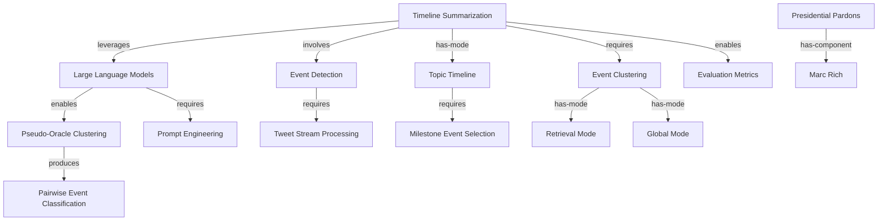

# Knowledge Graph: claude-haiku

**Generated from:** `2024.acl-long.390.pdf`
**Date:** 2025-11-14T19:06:55.609Z
**Processing time:** 103.9s
**Cost:** $0.0000

---

## Graph Statistics

- **Nodes:** 15
- **Edges:** 13
- **Chunks processed:** 3
- **Merged nodes:** 2
- **Duplicate edges removed:** 1
- **Quality score:** 100/100

---

## Nodes

1. **Timeline Summarization**
2. **Presidential Pardons**
3. **Large Language Models**
4. **Event Clustering**
5. **Event Detection**
6. **Topic Timeline**
7. **Pseudo-Oracle Clustering**
8. **Retrieval Mode**
9. **Global Mode**
10. **Tweet Stream Processing**
11. **Milestone Event Selection**
12. **Pairwise Event Classification**
13. **Prompt Engineering**
14. **Evaluation Metrics**
15. **Marc Rich**

---

## Relationships

1. **Timeline Summarization** → `leverages` → **Large Language Models**
2. **Timeline Summarization** → `involves` → **Event Detection**
3. **Timeline Summarization** → `has-mode` → **Topic Timeline**
4. **Large Language Models** → `enables` → **Pseudo-Oracle Clustering**
5. **Event Detection** → `requires` → **Tweet Stream Processing**
6. **Topic Timeline** → `requires` → **Milestone Event Selection**
7. **Pseudo-Oracle Clustering** → `produces` → **Pairwise Event Classification**
8. **Timeline Summarization** → `requires` → **Event Clustering**
9. **Event Clustering** → `has-mode` → **Retrieval Mode**
10. **Event Clustering** → `has-mode` → **Global Mode**
11. **Large Language Models** → `requires` → **Prompt Engineering**
12. **Timeline Summarization** → `enables` → **Evaluation Metrics**
13. **Presidential Pardons** → `has-component` → **Marc Rich**

---

## Mermaid Diagram

---

## How to Visualize

1. Copy the Mermaid code above
2. Paste it into one of these tools:
   - [Mermaid Live Editor](https://mermaid.live)
   - [GitHub Markdown](https://github.com) (supports Mermaid natively)
   - [VS Code with Mermaid extension](https://marketplace.visualstudio.com/items?itemName=bierner.markdown-mermaid)

---

*Generated with Graphex Graph Generation Pipeline v1.0*
